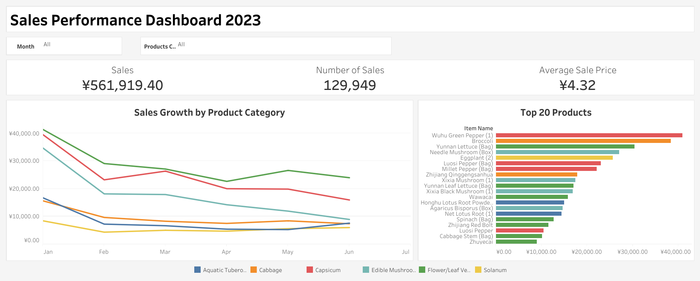
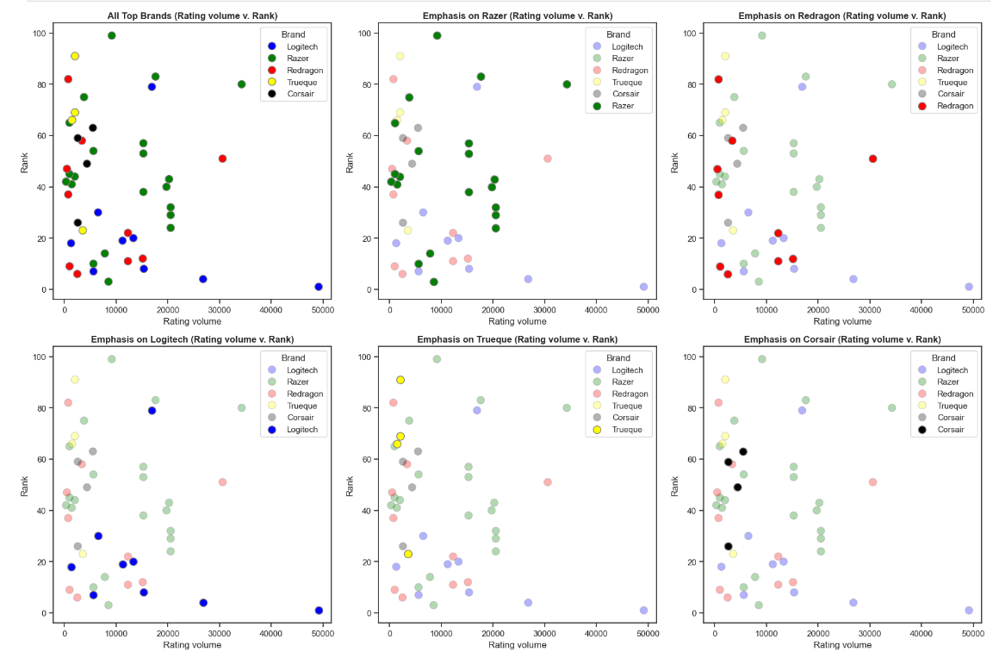
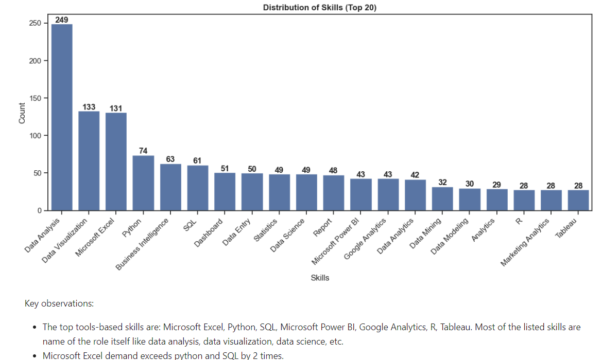

Welcome to my data portfolio!
My portfolio highlights a range of data projects, grouped together by the tools I have used.

## Table of Contents

- [Data Engineering](#)
- [SQL](#)
- [Python](#)
- [Data Visualization](#)

### 1. [Supermarket Sales Analysis with SQL](https://github.com/raufh10/supermarket_data_analysis_sql)

- **Objective and Methodology**: Investigate a supermarket database to uncover insights into sales trends, loss rates, and wholesale prices using advanced SQL queries and data analysis techniques.
- **Goals**: Provide detailed answers to business questions, understand loss rates and their impact on profitability, analyze wholesale price strategies, and identify sales trends to inform business strategies.
- **Features**: Utilize SQL for comprehensive data analysis, focusing on loss rates, wholesale prices, and sales trends. Employ data visualization tools to represent findings clearly and effectively.
- **Key Takeaways**: The analysis will reveal critical insights into the supermarket's operational efficiency, pricing strategies, and sales performance. Expected findings include identification of high-loss products, insights into wholesale pricing versus retail pricing strategies, and patterns in sales trends over time.
- **Actionable Insights**: Recommendations will likely include optimizing product assortment based on sales and loss data, revising pricing strategies to enhance profitability, and focusing on high-performing product categories to maximize sales.

for more details, please visit [Supermarket Sales Analysis with SQL](https://github.com/raufh10/supermarket_data_analysis_sql)

You could find the sales performance dashboard at [Tableau Public](https://public.tableau.com/app/profile/rauf.hamidy/viz/SalesPerformanceDashboard_17003520540570/Dashboard).

### 2. [Amazon Gaming Mice Product Analysis](https://github.com/raufh10/Amazon_Gaming_Mice_Data_Analysis)

- **Objective and Methodology**: Investigate the PC gaming mice market on Amazon using sophisticated web scraping techniques and detailed data analysis in Jupyter Notebook.
- **Goals**: Provide insights on market trends, pricing patterns, and key product features for businesses and consumers interested in PC gaming mice.
- **Features**: Utilize Python and Beautiful Soup for web scraping, process data for analysis, and generate visualizations with Matplotlib and Seaborn to illustrate findings.
- **Key Takeaways**: Analyzed data revealed an average price of $48.63, a preference for black mice, and identified four product clusters, with Razer and Logitech offering a wide price and quality range.
- **Actionable Insights**: Recommendations include budget planning around the average price, focusing on popular brands for quality and variety, using ratings as a quality indicator, and considering the price-to-quality correlation for better satisfaction.

for more details, please visit [Amazon Gaming Mice Product Analysis](https://github.com/raufh10/Amazon_Gaming_Mice_Data_Analysis)

### 3. [Upwork Job Postings Analysis](https://github.com/raufh10/Upwork_Job_Data_Analysis)

- **Objective and Methodology**: Analyze Upwork job postings to provide freelancers with insights using advanced web scraping and in-depth data analysis techniques.
- **Goals**: Offer insights into the job market, identify in-demand skills, and analyze rate structures to aid data analysts in navigating Upwork.
- **Features**: Employ Beautiful Soup for data scraping, utilize custom scripts for data cleaning, and conduct detailed analysis and visualization in Jupyter Notebook.
- **Conclusion and Insights**: Identified top in-demand skills like Excel, Python, and SQL; noted a weak negative relationship between project duration and hourly rates; observed hourly rate increases with experience level.
- **Actionable Insights**: Focus skill development on tools like Excel and Python, consider applying for shorter projects to maximize earnings, and adjust pricing strategies based on experience level for better job market positioning.

for more details, please visit [Upwork Job Postings Analysis](https://github.com/raufh10/Upwork_Job_Data_Analysis)
